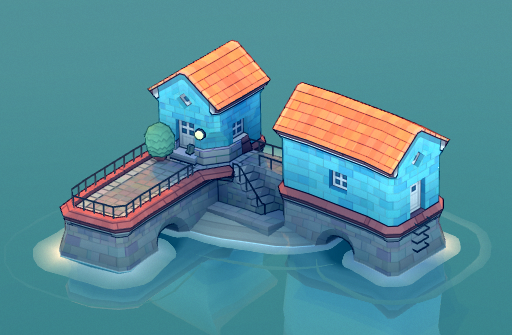
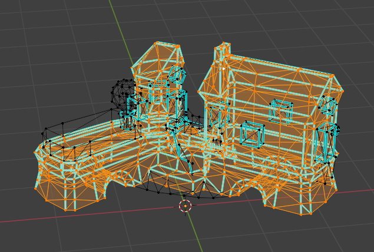
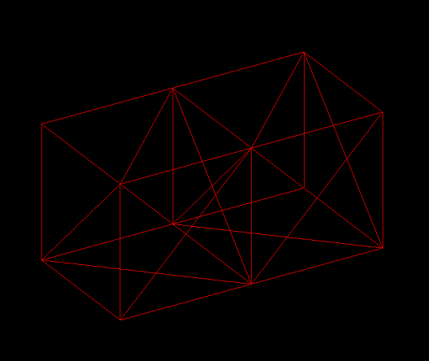
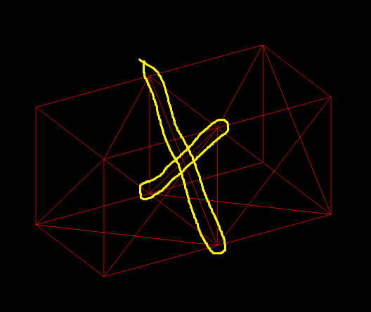
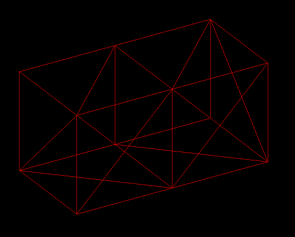
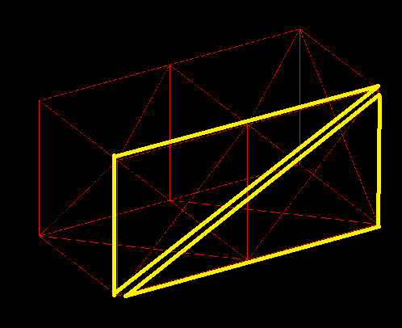
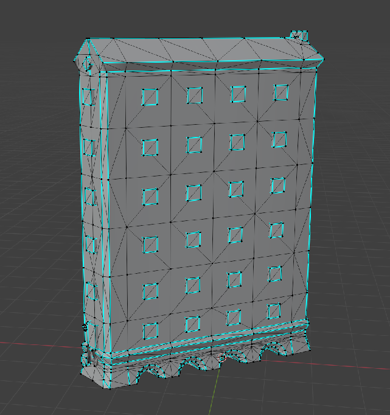

# Merging three.js meshes

The goal with this little experiment is to understand what needs to be done to merge multiples meshes into a single one.

The thought came to me when playing Townscaper.

I exported a simple town as `.obj`, opened it in Blender and saw that all the pieces were merged into a single mesh:

That's interesting because it's a single object being sent to the GPU, let alone there are redundant vertices since the hidden faces between blocks were deleted.

## The experiment

The experiment consists of two boxes displaced side by side, touching faces.

## mergeGeometries()

The first Google result suggested using `BufferGeometryUtils.mergeGeometries()`. While it does merge two geometries into one, it does not eliminate the hidden faces. The image below shows the two edges that were supposed to be gone:

## Constructive Solid Geometry

At some point I stumbled upon [this SO question](https://stackoverflow.com/q/35355615/778272) where I was introduced to the technique of [Constructive Solid Geometry](https://en.wikipedia.org/wiki/Constructive_solid_geometry) (CSG). The idea is then to use the union operation to merge geometries. 

[This Three.js example](https://threejs.org/examples/webgl_geometry_csg.html) shows how to use CSG via this library called three-bvh-csg.

It really worked to remove the hidden faces:

## Simplifying even further

The hidden face was removed, but there are still redundant triangles. For example, the front face is currently made of 4 triangles, but they could be just 2:

Townscaper is not doing it, though, as can be seen here:

Notice the wall is composed of several columns and rows. Even if we consider Townscaper's irregular grid and the fact that the building facade is not exactly a straight line, within a given column the individual blocks could be merged into a single one (since the building grows straight up).

Nevertheless, there's an open question if this optimization is worth doing, specially in cases where it needs to be performed in real time.
